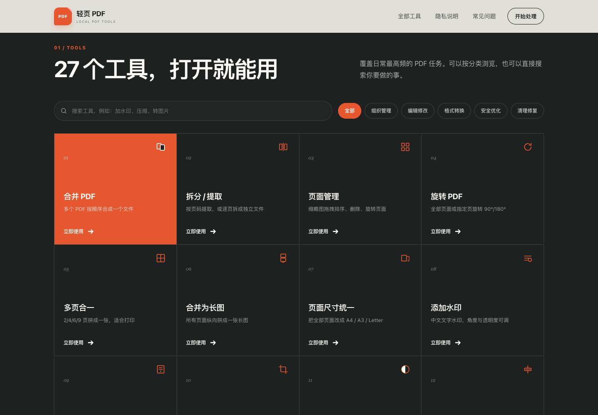
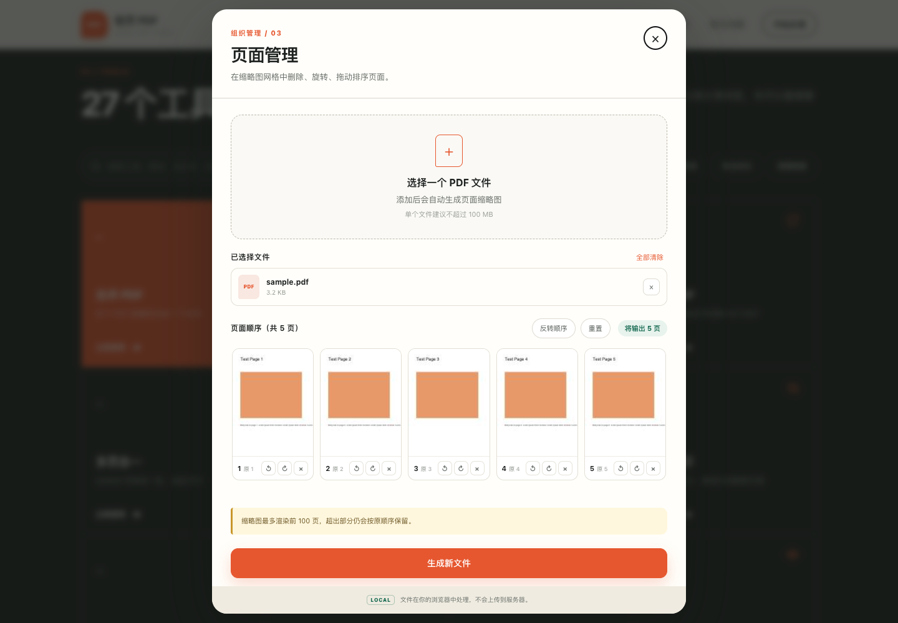

# 轻页 PDF

免费、免注册、文件不上传的在线 PDF 工具箱。**27 个工具全部在浏览器本地运行**，没有后端、没有账号、没有上传记录。

🔗 在线体验：<https://qingye-pdf-tools.app.workbuddy.host/>



页面管理支持缩略图拖拽排序、删除与单页旋转：



---

## 为什么不上传文件

所有解析、渲染与生成都在你的设备上完成：

- PDF 解析与写入：`@cantoo/pdf-lib`（MIT）
- 页面渲染与文字提取：`pdfjs-dist`（Apache-2.0）
- 打包：`JSZip`（MIT）
- OCR：`tesseract.js` + `tesseract.js-core`（Apache-2.0）

依赖已全部下载到 `vendor/`，站点不请求任何 CDN，刷新页面后内存中的文件即消失。

首屏只加载 pdf-lib（约 470KB）；pdfjs（含 1.26MB worker）按需加载。OCR 的 wasm 内核与语言模型合计约 8MB，放在 `vendor/ocr/`，只在真正使用 OCR 时才下载并缓存。

## 工具清单

### 组织管理

| 工具 | 说明 |
| --- | --- |
| 合并 PDF | 多文件按顺序合成，2 个起 |
| 拆分 / 提取 | 提取指定页，或逐页拆成 ZIP |
| 页面管理 | 缩略图拖拽排序、删除、单页旋转 |
| 旋转 PDF | 全部或指定页旋转 90°/180°/270° |
| 多页合一 | 2/4/6/9 页拼成一张，支持 A4/A3/Letter |
| 合并为长图 | 全部页面纵向拼成一张长图 |
| 页面尺寸统一 | 统一为 A3/A4/A5/Letter/Legal |

### 编辑修改

| 工具 | 说明 |
| --- | --- |
| 添加水印 | 中文文字水印，位置/角度/透明度/颜色可调，支持平铺 |
| 添加页码 | 起始数字、位置、格式（`1` / `- 1 -` / `1 / 10`） |
| 裁剪页面 | 四边数值裁剪，可保留最小边距 |
| 灰度转换 | 去色保留层次，可指定页码范围 |
| 纯黑白 | 阈值可调，体积最小 |
| 反色显示 | 生成夜间深色版本 |
| 页面背景色 | 铺纯色背景，打印省墨 |

### 格式转换

| 工具 | 说明 |
| --- | --- |
| PDF 转图片 | PNG/JPG，三档清晰度，多页打包 |
| 图片转 PDF | JPG/PNG/WebP，跟随图片或 A4 |
| 提取内嵌图片 | 抽出原始位图，非重新截图 |
| 提取文字 | 导出 TXT / Markdown |
| PDF 预览 | 站内阅读器，翻页与缩放 |

### 安全优化

| 工具 | 说明 |
| --- | --- |
| 压缩 PDF | 三档级别，扫描件效果最好，可指定页码范围 |
| 加密 PDF | AES-256，打开密码 + 权限限制 |
| 解密 PDF | 输入原密码，输出无密码副本 |
| 元数据工具 | 查看 / 修改 / 清除作者、标题等 |
| 权限设置 | 不设打开密码，只限制打印复制编辑 |

### 清理修复

| 工具 | 说明 |
| --- | --- |
| 删除空白页 | 自动识别无文字无图形的页 |
| 打包为 ZIP | 多文件合一 |
| OCR 识别 | 中英/日文识别，输出 PDF + 文本 |

## 已知边界

诚实说明当前实现做不到什么：

- **压缩、灰度、黑白、反色、背景色、裁剪、拼版、长图** 会把页面重新渲染为图片，因此**不保留文本层、链接、表单、批注与数字签名**。文字型 PDF 请优先用其他工具。
- **压缩不会更小**：浏览器拿不到 Ghostscript 级能力，只能重编码页面图像。若结果不小于原文件，会自动返回原文件副本而不是更大的结果。
- **加密密码无法找回**：没有服务端，忘记密码谁也打不开。
- **权限限制是提示性的**，可被高级工具绕过，不能替代加密。
- **PDF 转 Word / Excel、PDF/A、数字签名、真正的可搜索 OCR 文本层**暂未实现——前者需要 LibreOffice WASM（约 150 MB），后者需要嵌入中文字体子集。
- **删除空白页**对只有极浅内容的页面可能漏判，处理后请检查结果。
- **灰度 / 黑白 / 反色会让体积变大**：这是格式转换而非压缩，矢量页面转成位图后通常更大（实测约 5倍）。若需小体积请用「压缩 PDF」。
- **含空白页的文件**：空白页（无内容流）在扫描件与合并文件中很常见，处理这类文件时已自动补齐内容流，不会报错。
- **页数很多的文件**：灰度/黑白/反色/背景色、压缩、PDF 转图片、OCR、长图都需要逐页渲染成位图，内存随页数增长。超过约 120 页时会拦下来并提示——请用工具里的「页码范围」只处理需要的部分，或先用「拆分 PDF」分批处理。这不是功能缺失，是浏览器内存的硬限制（实测 300 页 200dpi扫描件转图片会占用近 500MB 堆、耗时近 50 秒，手机端可能直接闪退）。

## 开发

源码本身是纯静态站点，直接起服务器即可：

```bash
python3 -m http.server 4173
# 打开 http://127.0.0.1:4173
```

部署走 Cloudflare Pages，用一层薄构建脚本把源码整理成产物：

```bash
./deploy.sh --preview        # 只本地构建，产物在 dist/
./deploy.sh "改了什么"       # 构建 + 提交 + 推送，Pages 自动上线
```

Cloudflare Pages 项目的构建配置为：构建命令 `python3 build.py --build`，输出目录 `dist`。
`site/` 与 `dist/` 都不入库，云端会自己重新生成。详见 [DEPLOY.md](DEPLOY.md)。

目录结构：

```
index.html          页面结构 + SVG 图标 sprite（同时是 27 个落地页的模板）
styles.css          样式
main.js             UI 状态、工具面板、页面管理、阅读器、检索
lib/deps.js         依赖入口（vendor 同步导入 + pdfjs/OCR 懒加载）
lib/pdf-core.js     PDF 载入、渲染、页码解析、水印位图等基础能力
lib/registry.js     27 个工具的元数据与选项表单
lib/tools.js        各工具的处理实现
pages.py            27 个落地页的文案（构建期使用，不进运行时包）
vendor/             本地化的第三方库（含 ocr/ 的引擎与语言模型）
build.py            构建产物 + 生成落地页/_headers/sitemap/robots + 校验
deploy.sh           构建校验 → 提交 → 推送
```

新增一个工具：在 `lib/tools.js` 加处理函数 → `lib/registry.js` 注册元数据与选项 → `index.html` 加一张卡片并补一个 SVG 图标 → `pages.py` 补一条文案。

## 工具落地页

每个工具有一个独立 URL：`/tools/<slug>/`，例如 `/tools/merge/`。构建时由 `build.py` 读取 `pages.py` 的文案，以 `index.html` 为模板生成，共 27 页。

每页包含唯一的 `<title>` / H1 / meta description、面包屑、该工具的使用步骤、3 条专属问答（`FAQPage` 结构化数据）和相关工具链接。构建校验会强制检查这些项，缺一个就构建失败。

刻意**不自动弹出处理台**——弹窗会盖住正文，既看不清工具是干什么的，对搜索引擎也不友好。用户点首屏按钮再打开。落地页在 `<body data-tool="...">` 上标出当前工具，`main.js` 据此高亮卡片并把顶部 CTA 指向它。

## 许可

源码以 MIT 许可发布。依赖的第三方库各自遵循 MIT / Apache-2.0。
